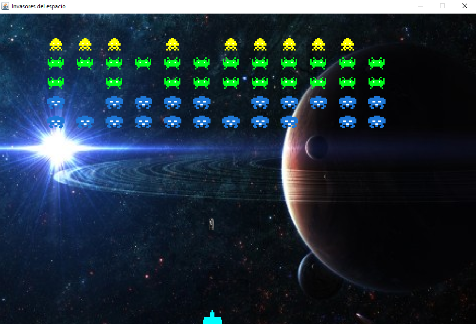

# Invasores del espacio
***
- Autor: Fernando García
- Fecha: -/-/2015
- email: fernando.garcia88x@gmail.com
***

Este programa fue desarrollado como parte del **examen de medio semestre** de la materia de sistemas distribuidos, de la carrera de electrónica y telecomunicaciones. El objetivo del programa es:

1. Demostrar la comprensión de la programacion orientada a objetos en el lenguaje de programacion java
2. Demostrar la capacidad de usar hilos en el lenguale java.

---

